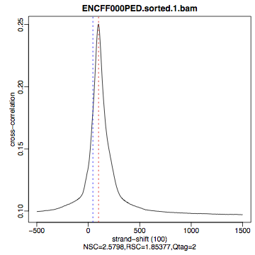
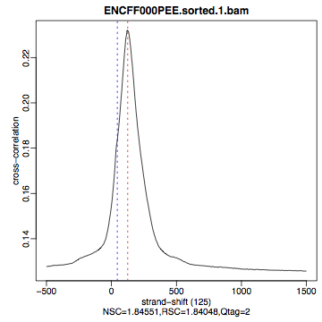
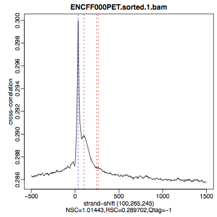
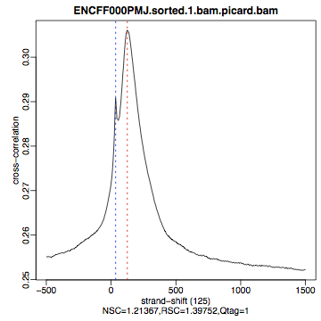
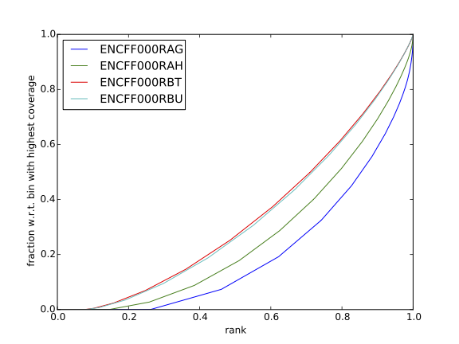
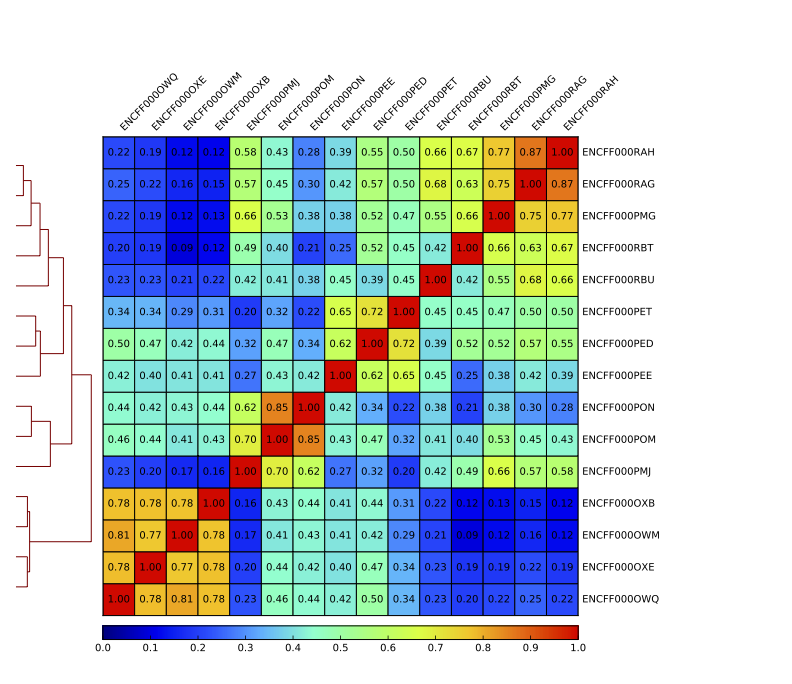
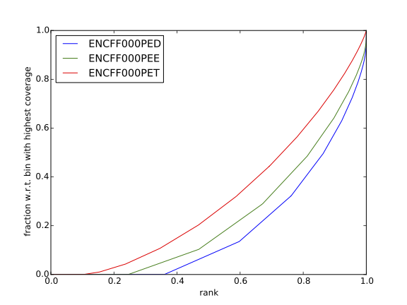

# ChIP-seq data processing and analysis tutorial 

## Introduction <a name="Introduction"></a>

REST (NRSF) is a transcriptional repressor that represses neuronal genes in non-neuronal cells. It is a member of the Kruppel-type zinc finger transcription factor family. It represses transcription by binding a DNA sequence element called the neuron-restrictive silencer element (NRSE). The protein is also found in undifferentiated neuronal progenitor cells and it is thought that this repressor may act as a master negative regulator of neurogenesis. In addition, REST has been implicated as tumour suppressor, as the function of REST is believed to be lost in breast, colon and small cell lung cancers.

One way to study REST on a genome-wide level is via ChIP sequencing (ChIP-seq). ChIP-seq is a method that allows to identify genome-wide occupancy patterns of proteins of interest such as transcription factors, chromatin binding proteins, histones, DNA / RNA polymerases etc.

The first question one needs to address when working with ChIP-seq data is "Did my ChIP work?", i.e. whether the antibody-treatment enriched sufficiently so that the ChIP signal can be separated from the background signal. After all, around 90% of all DNA fragments in a ChIP experiment represent the genomic background. This question is impossible to answer by simply counting number of peaks or by visual inspection of mapped reads in a genome browser. Instead, several quality control methods have been developed to assess the quality of the ChIP-seq data. These are introduced in the first part of this tutorial. The second part deals with identification of binding sites and signal visualisation. The third part is a collection of exercises which expand on techniques used in the first two parts as well as includes an example workflow for peak annotation and differential occupancy. You can choose to follow one or more or all of these additional exercises. Combined they present a complete workflow for detection of binding sites in ChIP-seq experiments.

## Content
- [Introduction](#Introduction)
- [Data](#Data)
- [Methods](#Methods)
- [Setting-up](#Setting-up)
- [Part 1: Quality control and data processing](#QC)
- [Part 2: Identification of binding sites](#BindingSites)
- [Part 3: Visualisation](#Visualisation)


## Data <a name="Data"></a>

We will use data that come from [ENCODE](www.encodeproject.org) project. These are ChiP-seq libraries (in duplicates) prepared to analyze REST transcritpion factor (mentioned in [Introduction](#Introduction)) in several human cells and in vitro differentiated neural cells. The ChIP data come with matching input chromatin samples. The accession numbers are listed in the Table 1 and separate sample accession numbers are listed in the Table 2


| No |  Accession  | Cell line | Description                                            |
| --- | ----------- | --------- | ------------------------------------------------------ |
| 1  | ENCSR000BMN |  HeLa     | adenocarcinoma (Homo sapiens, 31 year female)          |
| 2  | ENCSR000BOT |  HepG2    | hepatocellular carcinoma (Homo sapiens, 15 year male)  |
| 3  | ENCSR000BOZ |  SK-N-SH  | neuroblastoma (Homo sapiens, 4 year female)            |
| 4  | ENCSR000BTV |  neural   | in vitro differentiated (Homo sapiens, embryonic male) |

Table 1. ENCODE accession numbers for data sets used in this tutorial.


| No |  Accession  | Cell line | Replicate |    Input    |
| --- | ----------- | --------- | --------- | ----------- |
| 1  | ENCFF000PED | HeLa      | 1         | ENCFF000PET |
| 2  | ENCFF000PEE | HeLa      | 2         | ENCFF000PET |
| 3  | ENCFF000PMG | HepG2     | 1         | ENCFF000POM |
| 4  | ENCFF000PMJ | HepG2     | 2         | ENCFF000PON |
| 5  | ENCFF000OWQ | neural    | 1         | ENCFF000OXB |
| 6  | ENCFF000OWM | neural    | 2         | ENCFF000OXE |
| 7  | ENCFF000RAG | SK-N-SH   | 1         | ENCFF000RBT |
| 8  | ENCFF000RAH | SK-N-SH   | 2         | ENCFF000RBU |

Table 2. ENCODE accession numbers for samples used.


## Methods <a name="Methods">

 Reads were mapped by ECODE consortium to the human genome assembly version hg19 using bowtie, a short read aligner performing **ungapped (global)** alignment. Only reads with **one best alignment** were reported (sometimes also called "unique alignments" or "uniquely aligned reads") excluding reads mapping to multiple location in the genome from down-stream analyses.

To shorten computational time required to run steps in this tutorial scaled down dataset by keeping reads mapping to chromosomes 1 and 2 only. Note: for the post peak-calling QC and differential occupancy, the peaks on chromosomes 1 and 2 were selected from the peaks called using the full data set.


Initial steps of data analysis in a ChIP-seq experiment are focused on addressing two questions:

1. How successful was the ChIP-seq experiment? (quality control steps, part 1)

2. Identification of binding sites for the factor of interest. (peak calling steps, part 2)


The typical workflow in a ChIP-seq experiment (after an initial quality control, read preprocessing and read mapping to reference genome - steps not covered in this exercise)  includes:

1. Post-alignment quality control (QC) to assess successful enrichment in ChIP by computing cross-correlation profile and associated metrics; the tool of choice is phantompeakqualtools (part 1 of this class).

2. Processing of bam files to remove alignments of reads which
(i) are duplicates and
(ii) map to blacklisted regions ("hyper-chippable" regions).
These reads may result from experimental artefacts and their presence may bias downstream analyses.
Additionally, in  this step you will compute normalised coverage tracks; these will be later viewed in a genome browser
(part 1 of this class).

3. Other post-alignment QC steps (part 3 of this class, additional exercises) include calculation of
	(i) cumulative enrichment
	(ii) sample clustering in genomic bins mode.

4. Identification of binding sites. Enriched regions aka peaks are identified using MACS2. After peak calling, several checks can be performed on the peak regions, for example selection of peaks consistently identified in both biological replicates. Subsequently, to assess similarity of binding profiles between samples, another round of sample clustering can be performed, this time of signal resulting from reads mapped to regions identified as the binding sites in all libraries.
(part 2 of this class)


5. Signal visualisation in a genome browser. The read alignments, normalised coverage tracks and binding sites are visualised for general signal assessment (part 2 of this class).
Integrative genome browser [IGV](https://www.broadinstitute.org/igv/) is an easy to use tool compatible with all operating systems - please install it in your local computer if you haven't done so already.

6. Additional exercises (part 3 of this class):

	6.1. Computing cumulative enrichment as another metric to assess enrichment on ChIP-seq (deepTools).

	6.2. Computing correlation between libraries in bins mode: in this method the genome is divided into bins of specified size and reads mapped to each bin are counted; the resulting signal profiles are used to cluster libraries to identify groups of similar signal profile (deepTools).

	6.3. Alternative method for post-peak calling QC (R script, library ChIPQC).

	6.5. Peak annotation and differential occupancy (R script, libraries ChIPpeakAnno and DiffBind).

	6.6. Visualisation of the ChIP signal associated with genomic regions (deepTools).


Please note that all methods used in this exercise perform significantly better when used on complete (i.e. non-subset) data sets. Their accuracy most often scales with the number of mapped reads in each library, but so does the run time. As a reference, for some of the steps, plots generated analysing the complete data set are also presented in the Appendix of this document.

Last but not least, we have prepared intermediate files in case some step won't work; these will allow you to progress through the analysis. You will find them in the `/results` directory.

## Setting-up  <a name="Setting-up">

### Using computational resources
We have booked half a node on Milou per course participant. To run the tutorial in the interactive mode log to Milou and run _salloc_ command. <font color='red'> Note: run salloc only once not to take away node allocation from other course participants</font>. 

```bash
ssh -Y username@milou.uppmax.uu.se
salloc -A g2017022 -t 08:00:00 -p core -n 8 --no-shell --reservation=g2017022_1 &
```

Check which node you were assigned
```bash
$ squeue -u <username>
```

And connect to your node with
```bash
ssh -Y <nodename>
```

### Files structures
There are many files which are part of the data set as well as there are additional files with annotations that are required to run various steps in this tutorial. Therefore saving files in a structured manner is essential to keep track of the analysis steps (and always a good practice). We have preset data access and environment for your. To use these settings run:

* `chiseq_data.sh` that sets up directory structure and creates symbolic links to data as well as copies smaller files **run once**
* `chipseq_env.sh` that sets several environmental variables you will use in the exercise: **run every time when the connection to Uppmax has been broken, i.e. via logging out**

Copy the scripts to your home directory and execute them:

```bash
cp /sw/courses/ngsintro/chipseq/scripts/setup/chipseq_data.sh ./
cp /sw/courses/ngsintro/chipseq/scripts/setup/chipseq_env.sh ./

source chipseq_data.sh
source chipseq_env.sh
```

You should see a directory named "chipseq"

```bash
ls ~
cd ~/chipseq/analysis
```

### Commands and modules
Many commands are quite long as there are many input files as well several parameters to set up. Consequently a command may span over several lines of text. The backslash character ("\\") indicates to the interpreter that the command input will continue in the following line, not executing the command prematurely. To see all options for applications used throughout the class type `command -h` to view usage help.

You will notice that you will load and unload modules practically before and after each command: this is done because there are often dependency conflicts between the modules used in this exercise. If not unloaded some modules will cause error messages from the module system on Milou. More on module system is here: [https://www.uppmax.uu.se/resources/software/module-system/](https://www.uppmax.uu.se/resources/software/module-system/)

<font color='red'> Note: the commands in this tutorial contain pathways as we preset everything for you in the above step. In case you change files locations you will need to adjust commands accordingly.</font>

<br />
## Part I: Quality control and alignment processing <a name="QC"></a>
As disucssed in the lecture and mentioned in the introduction, before being able to draw any biological conlusions from the ChIP-seq data we need to assess the quality of libraries, i.e. how successful was the ChIP-seq experiment. In fact, quality assessment of the data is something that should be kept in mind at every data analysis step. Here, we will look at the quality metrics independent of peak calling, that is we begin at the very beginning, with the aligned reads. A typical workflow includes:
- strand cross-correlation analysis
- alignment processing: removing dupliated reads, "hyper-chippable" regions, prepraing noramlised coverage tracks for viewing in a genome browser
- cumulative enrichment 
- BAM clustering

### Strand cross-correlation 
Strand cross-correlation is based on the fact that a high-quality ChIP-seq experiment produces significant clustering of enriched DNA sequence tags at locations bound by the protein of interest, and that the sequence tag density accumulates on forward and reverse strands centered around the binding site. The cross-correlation metric is computed as the Pearson's linear correlation between the Crick strand and the Watson strand, after shifting Watson by _k_ base pairs. This typically produces two peaks when cross-correlation is plotted against the shift value: a peak of enrichment corresponding to the predominant fragment length and a peak corresponding to the read length ("phantom" peak).

We will calculate cross correlation for REST ChIP-seq in HeLa cells using a tool called [phantompeakqualtools](https://github.com/kundajelab/phantompeakqualtools)

```bash
module load phantompeakqualtools/1.1

mkdir ~/chipseq/analysis/xcor
cd ~/chipseq/analysis/xcor

run_spp.R -c=../../data/ENCFF000PED.chr12.bam -savp=hela1_xcor.pdf \
-out=xcor_metrics_hela.txt

module unload phantompeakqualtools/1.1
```

This step takes a few minutes and phantompeakqualtools prints messages as it progresses through different stages of the analysis. When completed have a look at the output file `xcor_metrics_hela.txt`. The metrics file is tabulated and the fields are:

```bash
COL1: Filename

COL2: numReads: effective sequencing depth i.e. total number of mapped reads
 in input file

COL3: estFragLen: comma separated strand cross-correlation peak(s) in decreasing
 order of correlation. In almost all cases, the top (first) value in the list
 represents the predominant fragment length.

COL4: corr_estFragLen: comma separated strand (Pearson) cross-correlation value(s)
 in decreasing order (col3 follows the same order)

COL5: phantomPeak: Read length/phantom peak strand shift

COL6: corr_phantomPeak: Correlation value at phantom peak

COL7: argmin_corr: strand shift at which cross-correlation is lowest

COL8: min_corr: minimum value of cross-correlation

COL9: Normalized strand cross-correlation coefficient (NSC) = COL4 / COL8

COL10: Relative strand cross-correlation coefficient
 (RSC) = (COL4 - COL8) / (COL6 - COL8)

COL11: QualityTag: Quality tag based on thresholded RSC
  (codes: -2:veryLow; -1:Low; 0:Medium; 1:High; 2:veryHigh)
```

The columns to pay attention to are:

```bash
COL3: gives the fragment length as estimated from the data;

COL9: NSC; NSC>1.1 (higher values indicate more enrichment; 1 = no enrichment)

COL10: RSC; RSC>0.8 (0 = no signal; <1 low quality ChIP; >1 high enrichment

COL11: Quality tag based on thresholded RSC
(codes: -2:veryLow,-1:Low,0:Medium,1:High; 2:veryHigh)
```

For comparison, the cross correlation metrics computed for the entire data set using non-subset data are available by:

```bash
cat ../../results/xcor/rest.xcor_metrics.txt
```

The shape of the strand cross-corrlelation can be more informative than the summary statistics, so do not forget to view the plot. 
- compare the plot `hela1_xcor.pdf` (cross correlation of the first replicate of REST ChIP in HeLa cells, using subset chromosome 1 and 2 subset data) with cross correlation computed using the all chromosomes data set (figures 1 - 3)
- compare with the ChIP using the same antibody performed in HepG2 cells (figures 4 - 6).

To view .pdf directly from Uppmax with enabled X-forwarding:
```bash
evince hela1_xcor.pdf &
```

Otherwise, if the above does not work due to common configuration problems, copy the .pdf file to your local compouter and open locally. To copy type from **a terminal window on your computer NOT connected to Uppmax**: 
```bash
scp <username>@milou.uppmax.uu.se:~/chipseq/analysis/xcor/*pdf ./
```

-----

|Figure 1. <br> HeLa, REST ChIP  <br>  replicate 1, QScore:2 | Figure 2. <br> HeLa, REST ChIP <br> replicate 2, QScore:2  | Figure 3. <br> HeLa, input <br> QScore:-1                                         |
| --- | ----------- | --------- |
|| | |


----


|Figure 4. <br> HepG2, REST ChIP  <br>  replicate 1, QScore:0 | Figure 5. <br> HepG2, REST ChIP <br> replicate 2, QScore:1  | Figure 6. <br> HepG2, input <br> QScore:0                                        |
| --- | ----------- | --------- |
|| | |

-----

**What do you think?** Did the ChIP-seq experiment work?
- how would you rate these particular two data sets? 
- are all samples of good quality? 
- which data set would you rate higher in terms of how successful the ChIP was? 
- would any of the samples fail this QC step? Why? 


### Alignment processing 
Now we will do some data cleaning to try to improve the librarires quality. First, duplicated reads are marked and removed using MarkDuplicates tool from [Picard](http://broadinstitute.github.io/picard/command-line-overview.html#MarkDuplicates). Marking as "duplicates" is based on their alignment location, not sequence.

```bash
module load samtools/1.1
module load java/sun_jdk1.8.0_40
module load picard/1.141

cd ~/
mkdir ~/chipseq/analysis/bam_preproc
cd ~/chipseq/analysis/bam_preproc

java -Xmx64G -jar $PICARD_HOME/picard.jar MarkDuplicates \
I=../../data/ENCFF000PED.chr12.bam O=ENCFF000PED.chr12.rmdup.bam \
M=dedup_metrics.txt VALIDATION_STRINGENCY=LENIENT \
REMOVE_DUPLICATES=true ASSUME_SORTED=true
```
Check out `dedup_metrics.txt`

Second, reads mapped to [ENCODE blacklisted regions](https://sites.google.com/site/anshulkundaje/projects/blacklists) are removed

```bash
module load NGSUtils/0.5.9

bamutils filter ENCFF000PED.chr12.rmdup.bam \
ENCFF000PED.chr12.rmdup.filt.bam \
-excludebed ../../hg19/wgEncodeDacMapabilityConsensusExcludable.bed nostrand
```

Finally, the processed bam files are sorted and indexed:

```bash
samtools sort -T sort_tempdir -o ENCFF000PED.chr12.rmdup.filt.sort.bam \
ENCFF000PED.chr12.rmdup.filt.bam

samtools index ENCFF000PED.chr12.rmdup.filt.sort.bam

module unload samtools/1.1
module unload java/sun_jdk1.8.0_40
module unload picard/1.141
module unload NGSUtils/0.5.9
```

### Computing read coverage

Now we will compute the read coverage normalised to 1x coverage using tool bamCoverage from [deepTools](http://deeptools.readthedocs.io/en/latest/content/tools/bamCoverage.html), a set of tools developed for ChIP-seq data analysis and visualisation. Normalised tracks enable comparing libraries sequenced to a different depth when viewing them in a genome browser such as [IGV](http://deeptools.readthedocs.io/en/latest/content/tools/bamCoverage.html). We are still using data subset (chromosomes 1 and 2) hence the effective genome size used is 492449994 (4.9e8) (for hg19 the effective genome size is 2.45e9 (see [publication](http://www.nature.com/nbt/journal/v27/n1/fig_tab/nbt.1518_T1.html)). The reads are extended to 110 nt (the fragment length obtained from the cross correlation computation) and summarised in 50 bp bins (no smoothing). 

```bash
module load deepTools/2.0.1

bamCoverage --bam ENCFF000PED.chr12.rmdup.filt.sort.bam \
 --outFileName ENCFF000PED.chr12.cov.norm1x.bedgraph \
 --normalizeTo1x 492449994 --extendReads 110 --binSize 50 \
 --outFileFormat bedgraph

module unload deepTools/2.0.1
```

### Cumulative enrichment

Cumulative enrichment, aka .BAM fingerprint, is yet another way to inspect inspect enrichment in the libraries. The advantage of this plot over strand correlation is that it offers a quick inspection of multiple librararies and their differences to the corrresponding inputs. To compute cumulative enrichment forHeLa REST ChIP and the corresponding input sample:

```bash
module load deepTools/2.0.1

plotFingerprint --bamfiles ENCFF000PED.chr12.rmdup.filt.sort.bam \
../../data/bam/hela/ENCFF000PEE.chr12.rmdup.sort.bam  \
../../data/bam/hela/ENCFF000PET.chr12.rmdup.sort.bam  \
 --extendReads 110  --binSize=1000 --plotFile HeLa.fingerprint.pdf \
--labels HeLa_rep1 HeLa_rep2 HeLa_input

module unload deepTools/2.0.1
```
Have a look at the `HeLa.fingerprint.pdf`
- does it indicate a agood sample quality, i.e. enrichment in ChIP samples and lack of enrichment in input? 
- how does it compare to similar plots generated for other libraries shown below?
- can you tell which samples are ChIP and which are input? 
- are the cumulative enrichment plots in agreement with the cross-correlation metrics computed earlier?


|Figure 7. <br> Cumulative enrichment for REST ChIP and corresponding inputs    <br> in HepG2 cells | Figure 8. <br> Cumulative enrichment for REST ChIP and corresponding inputs    <br> in SK-N-SH cells |
| --- | ----------- |
|| |


### Sample clustering

To assess overall similarity between libraries from different samples and data sets, you will compute sample clustering heatmaps using multiBamSummary and plotCorrelation in bins mode from deepTools. In this method the genome is divided into bins of specified size (--binSize parameter) and reads mapped to each bin are counted; the resulting signal profiles are used to cluster libraries to identify groups of similar signal profile.

This section is performed using data subset to chromosomes 1 and 2.

First, to avoid very long paths in the command line, create subdirectories and link preprocessed bam files:

```bash
mkdir hela
mkdir hepg2
mkdir sknsh
mkdir neural
ln -s /sw/courses/ngsintro/chipseq/data/bam/hela/* ./hela
ln -s /sw/courses/ngsintro/chipseq/data/bam/hepg2/* ./hepg2
ln -s /sw/courses/ngsintro/chipseq/data/bam/sknsh/* ./sknsh
ln -s /sw/courses/ngsintro/chipseq/data/bam/neural/* ./neural

```


```bash
module load deepTools/2.0.1

multiBamSummary bins --bamfiles hela/ENCFF000PED.chr12.rmdup.sort.bam \
hela/ENCFF000PEE.chr12.rmdup.sort.bam hela/ENCFF000PET.chr12.rmdup.sort.bam \
hepg2/ENCFF000PMG.chr12.rmdup.sort.bam hepg2/ENCFF000PMJ.chr12.rmdup.sort.bam \
hepg2/ENCFF000POM.chr12.rmdup.sort.bam hepg2/ENCFF000PON.chr12.rmdup.sort.bam \
neural/ENCFF000OWM.chr12.rmdup.sort.bam neural/ENCFF000OWQ.chr12.rmdup.sort.bam \
neural/ENCFF000OXB.chr12.rmdup.sort.bam neural/ENCFF000OXE.chr12.rmdup.sort.bam \
sknsh/ENCFF000RAG.chr12.rmdup.sort.bam sknsh/ENCFF000RAH.chr12.rmdup.sort.bam \
sknsh/ENCFF000RBT.chr12.rmdup.sort.bam sknsh/ENCFF000RBU.chr12.rmdup.sort.bam \
 --outFileName multiBamArray_dT201_preproc_bam_chr12.npz --binSize=5000 \
--extendReads=110 --labels hela_1 hela_2 hela_i hepg2_1 hepg2_2 hepg2_i1 hepg2_i2 \
neural_1 neural_2 neural_i1 neural_i2 sknsh_1 sknsh_2 sknsh_i1 sknsh_i2

plotCorrelation --corData multiBamArray_dT201_preproc_bam_chr12.npz \
--plotFile REST_bam_correlation_bin.pdf --outFileCorMatrix corr_matrix_bin.txt \
--whatToPlot heatmap --corMethod spearman

module unload deepTools/2.0.1
```

Inspect the resulting pdf. How does it differ from the clustering performed on signal in peaks?


## Part II: Identification of binding sites <a name="BindingSites"></a>
You will identify peaks in the ChIPseq data using MACS2. MACS2 is one of the most popular peak callers, and it performs very well on data sets with good enrichment of transcription factors ChIP-seq. Peaks should be called on each replicate separately (do not pool the replicates) and peaks identified consistently across replicates should be used in downstream analyses of differential occupancy, annotation etc.

As before, this section is performed using data subset to chromosomes 1 and 2; hence the effective genome size used is 492449994 (4.9e8). To avoid long paths in the command line, you will link the necessary bam files with chip and input data. You will call peaks only in one ChIP-seq library; the rest of the work is already done, and the peaks are in the directory `/results/peaks_macs` (for HeLa cells only) and in bed format `/results/peaks_bed`.

```bash
cd ..
mkdir peak_calling
cd peak_calling

ln -s /sw/courses/ngsintro/chipseq/data/bam/hela/ENCFF000PED.chr12.rmdup.sort.bam \
./ENCFF000PED.preproc.bam
ln -s /sw/courses/ngsintro/chipseq/data/bam/hela/ENCFF000PET.chr12.rmdup.sort.bam \
./ENCFF000PET.preproc.bam
```


### Peak Calling

There are several parameters which affect peak calling itself, as well as result reporting. It is important to understand them to modify the command to the needs of your data set.

Meaning of the parameters:

-t, -c, -f, -n denote treatment, control, file format and output file names, respectively

-g is the genome size, in this case it is already encoded in MACS:
-g hs   =  -g 2.7e9;
-g mm   =  -g 1.87e9;
-g ce   =  -g 9e7;
-g dm   =  -g 1.2e8.

-q 0.01 is the q value (FDR) cutoff for reporting peaks; this is recommended over reporting using raw (undajusted) p value.

In our case, you use -g  4.9e8 because for peak calling you use data from chromosomes 1 and 2 only (total size is 4.9e8 bp).

You will see the progress of the analysis printed in the terminal (MACS prints messages as it progresses through different stages of the process). This step may take more than 10 minutes.


```bash
module load MACS/2.1.0

macs2 callpeak -t ENCFF000PED.preproc.bam -c ENCFF000PET.preproc.bam \
-f BAM -g 4.9e8 -n hela_1_REST.chr12.macs2 -q 0.01

module unload MACS/2.1.0
module unload python/2.7.6
```

The output of a MACS2 run consists of several files. You can inspect their content using

```bash
head -n 50 filename
```

You will use the `narrowPeak` files in the subsequent parts. These files are in [bed](https://genome.ucsc.edu/FAQ/FAQformat.html#format1) format, which is one of the popular file format used in genomics. It is used to store information on genomic ranges (such as ChIP-seq peaks, gene models, transcription starts sites, etc). Bed files can be also used for visualisation in genome browsers, including the popular [UCSC Genome Browser](https://genome.ucsc.edu/cgi-bin/hgTracks) and [IGV](https://www.broadinstitute.org/igv), which you will use later in part "Visualisation".


Files used in this step are derived from the `*.narrowPeak` files by selecting relevant columns, for example:

```bash
cut -f 1-3 hela_1_REST.chr12.macs2_peaks.narrowPeak >hela_1_chr12_peaks.bed
```


Peaks detected on chromosomes 1 and 2 are present in directory `/results/peaks_bed`. These peaks were detected using the non-subset data, and therefore there may be differences between the peaks present in the prepared `hela_1_peaks.bed` file compared to the peaks you have just detected. Use these pre-made peak bed files instead of the file you have just created. You can check how many peaks were detected in each library by listing number of lines in each file:

```bash
wc -l ../../results/peaks_bed/*.bed
```

```bash
cp ../../results/peaks_bed/*.bed ./
```


By checking for overlaps in the peak lists from different libraries you can detect peaks present in both libraries. This will give you an idea which peaks are reproducible between replicates.
[Bedtools](http://bedtools.readthedocs.org/en/latest/) is a suite of utilities developed for manipulation of bed files.

In the command used here, the arguments are

-a, -b : two files to be intersected

-f 0.50 : fraction of the overlap between features in each file to be reported as an overlap

-r : reciprocal overlap fraction required


Select two replicates of the same condition, for example:

```bash
module load BEDTools/2.25.0

bedtools intersect -a hela_1_peaks.chr12.bed -b hela_2_peaks.chr12.bed -f 0.50 -r \
> peaks_hela.chr12.bed

wc -l peaks_hela.chr12.bed
```

This way you can compare peaks from replicates of the same condition, and peaks present in different conditions. You will need to create files with peaks common to replicates for the cell types you wish to compare (as in the example above). You can inspect which peaks were reproducibly found in two different cell lines, for example:

```bash
bedtools intersect -a peaks_hepg2.chr12.bed -b peaks_hela.chr12.bed -f 0.50 -r \
> peaks_hepg2_hela.chr12.bed

wc -l peaks_hepg2_hela.chr12.bed
```

When you have done all intersections you were interested in, unload the Bedtools module:

```bash
module unload BEDTools/2.25.0
```


Now you will generate a merged list of all peaks detected in the experiment, which will be needed in the next step. In this list, all overlapping intervals are merged, and a list of non-overlapping intervals is created. To do this, you will use another suite of tools for manipulation of bed files, [BEDOPS](http://bedops.readthedocs.org/en/latest/). Files used in this step are derived from the `*.narrowPeak` files by selecting relevant columns, as before.

These files are already prepared and present in the directory `peak_calling` (your current directory, if you follow the directory structure in the exercise).

```bash
module load BEDOPS/2.4.3

bedops -m hela_1_peaks.chr12.bed hela_2_peaks.chr12.bed hepg2_1_peaks.chr12.bed hepg2_2_peaks.chr12.bed \
neural_1_peaks.chr12.bed neural_2_peaks.chr12.bed sknsh_1_peaks.chr12.bed sknsh_2_peaks.chr12.bed \
>REST_peaks.chr12.bed

module unload BEDOPS/2.4.3

wc -l REST_peaks.chr12.bed
```

In case things go wrong at this stage, you can find the merged list of all peaks in the `/results` directory. Link the file to your current directory


```bash
ln -s ../../results/peaks_bed/rest_peaks.chr12.bed ./rest_peaks.chr12.bed
```

[//]: #
[//]: # (Clustering in peaks)
[//]: #

### Quality Control After Peak Calling: Are the peaks consistent between replicates?

This section is performed using data subset to chromosomes 1 and 2. For the subsequent parts, you will use peaks which were called in the non-subset data set, and peaks located on chromosomes 1 and 2 were selected.

You will use multiBamSummary and plotCorrelation in the BED-file mode (deepTools). You will provide a list of intervals where reads are counted; this list is a merged list of all peaks detected in all libraries you have created in the previous step. You will begin by making a new directory and creating links to the data there.


```bash
cd ..
mkdir plots
cd plots

mkdir hela
mkdir hepg2
mkdir sknsh
mkdir neural
ln -s /sw/courses/ngsintro/chipseq/data/bam/hela/* ./hela
ln -s /sw/courses/ngsintro/chipseq/data/bam/hepg2/* ./hepg2
ln -s /sw/courses/ngsintro/chipseq/data/bam/sknsh/* ./sknsh
ln -s /sw/courses/ngsintro/chipseq/data/bam/neural/* ./neural

module load deepTools/2.0.1

multiBamSummary BED-file --BED ../peak_calling/REST_peaks.chr12.bed --bamfiles \
hela/ENCFF000PED.chr12.rmdup.sort.bam \
hela/ENCFF000PEE.chr12.rmdup.sort.bam hela/ENCFF000PET.chr12.rmdup.sort.bam \
hepg2/ENCFF000PMG.chr12.rmdup.sort.bam hepg2/ENCFF000PMJ.chr12.rmdup.sort.bam \
hepg2/ENCFF000POM.chr12.rmdup.sort.bam hepg2/ENCFF000PON.chr12.rmdup.sort.bam \
neural/ENCFF000OWM.chr12.rmdup.sort.bam neural/ENCFF000OWQ.chr12.rmdup.sort.bam \
neural/ENCFF000OXB.chr12.rmdup.sort.bam neural/ENCFF000OXE.chr12.rmdup.sort.bam \
sknsh/ENCFF000RAG.chr12.rmdup.sort.bam sknsh/ENCFF000RAH.chr12.rmdup.sort.bam \
sknsh/ENCFF000RBT.chr12.rmdup.sort.bam sknsh/ENCFF000RBU.chr12.rmdup.sort.bam \
--outFileName multiBamArray_bed_bam_chr12.npz \
--extendReads=110 \
--labels hela_1 hela_2 hela_i hepg2_1 hepg2_2 hepg2_i1 hepg2_i2 neural_1 \
neural_2 neural_i1 neural_i2 sknsh_1 sknsh_2 sknsh_i1 sknsh_i2

plotCorrelation --corData multiBamArray_bed_bam_chr12.npz \
--plotFile correlation_peaks.pdf --outFileCorMatrix correlation_peaks_matrix.txt \
--whatToPlot heatmap --corMethod pearson --plotNumbers --removeOutliers

module unload deepTools/2.0.1
```

In the pattern of library clustering consistent with biological differences between the samples and the cell lines?

[//]: #
[//]: # (IGV)
[//]: #


## Part III: Visualisation <a name="Visualisation"></a>


### Visualisation of mapped reads, coverage profiles and peaks in a genome browser

This part of the exercise requires installation of Interactive Genome Browser [IGV](https://www.broadinstitute.org/igv/) and it should be performed on your own computer (IGV is much faster when run locally). In fact, you are already familiar with IGV, as you used it during the variant calling class. You will view the following files (copy them from Uppmax):

REST ChIP in HeLa cells, replicate 1 (the files you created so far, or):

```bash
../data/bam/hela/ENCFF000PED.chr12.rmdup.sort.bam
../data/bam/hela/ENCFF000PED.chr12.rmdup.sort.bam.bai

../results/coverage/ENCFF000PED.cov.norm1x.bedgraph

../results/peaks_macs/hela_1_REST.chr12.macs2_peaks.narrowPeak
```

input in HeLa cells:

```bash
../data/bam/hela/ENCFF000PET.chr12.rmdup.sort.bam
../data/bam/hela/ENCFF000PET.chr12.rmdup.sort.bam.bai

../results/coverage/ENCFF000PEE.cov.norm1x.bedgraph
```

Remember setting the reference genome to hg19 - this is the assembly the reads were mapped to.

In IGV, in menu "File": "Load from file", select files you want to visualise. Load the selected tracks. Click on chromosome 1 or 2, zoom in and explore! Go to one of the locations you found interesting (for example, of the REST binding peaks detected in both HeLa samples), available in the file peaks_hela.bed, which you generated earlier.

You can change the signal display mode in the tracks in the left hand side panel. Right click in the bam file track, select from the menu "display" - squishy; "color by" - read strand and "group by" - read strand.

Is the read distribution in the peaks (bam file tracks) consistent with the expected bimodal distribution? Are the detected peaks associated with annotated genes?


[//]: #
[//]: # (Additional exercises)
[//]: #


## Part 3: Additional analyses
The following parts are optional, and can be preformed independently of one another.

The parts using R can be performed either by executing the scripts provided with the exercise from the command line, or by typing in all commands in an R console. The latter is recommended for people who have some previous exposure to the R environment. Post-peak calling QC is performed using the R / Bioconductor package ChIPQC, and some steps are redundant with the steps already performed; it is an alternative to the already presented workflow. Differential Occupancy and Peak Annotation sections present examples using R packages developed specifically for analysis of ChIP-seq data (there are many more useful packages in Bioconductor).


### Alternative Quality Control Workflow in R

Before you start using R, you need to set the environmental variable that holds information on where R libraries are installed. In this exercise you will use libraries installed in the class home directory (simply because it takes quite some time to install all dependencies). The path should already be set, inspect it by:

```bash
echo $R_LIBS
```

The result should be `/sw/courses/ngsintro/chipseq/software/R_lib`. If it is not, source the `chipseq_env.sh` script.


You will start in directory `/analysis/R`. The file `REST_samples.txt` contains information on files location, and the paths are given in relation to `/analysis/R`; if you choose to start in another directory, please modify the paths in `REST_samples.txt`. This script takes a while to run.

```bash
cd ../analysis/R
Rscript chipqc.R
```

Inspect the html output of this script.

### Differential Occupancy and Peak Annotation in R

Before you start using R, you need to set the environmental variable that holds information on where R libraries are installed. In this exercise you will use libraries installed in the class home directory (simply because it takes quite some time to install all dependencies). The path should already be set, inspect it by:

```bash
echo $R_LIBS
```

The result should be `/sw/courses/ngsintro/chipseq/software/R_lib`. If it is not, source the `chipseq_env.sh` script.

Please note that normally three biological replicates are required for statistical analysis of factor occupancy. There are only two replicates each in the ENCODE data sets used in this class - hence you use duplicates for demonstration sake. This script uses the same sample information file as the previous one; the paths are all relative to the `/analysis/R directory`.

```bash
cd ../analysis/R
Rscript diffbind_annot.R
```

People familiar with R can modify and execute the commands from within the R terminal, selecting different contrasts of interest, for example.

### Signal visualisation using deepTools

You will visualise ChIP signal in relation to annotated transcription start sites (TSS) on chromosomes 1 and 2. A description of all visualisation options is given at [deepTools](http://deeptools.readthedocs.org/en/latest/content/list_of_tools.html). Create a separate directory in `/analysis`; cd to it. Check if all the paths to create links are correct for the location of your directory. For details on the options of the applications used, please consult the documentation available at [computeMatrix](http://deeptools.readthedocs.org/en/latest/content/tools/computeMatrix.html) and [plotHeatmap](http://deeptools.readthedocs.org/en/latest/content/tools/plotHeatmap.html).

First you will compute the matrix of values using computeMatrix. This program takes [bigWig](https://genome.ucsc.edu/goldenpath/help/bigWig.html) files as input; you will need to convert bedgraph to bigWig using UCSC utilities:

```bash
cd analysis/
mkdir vis
cd vis

cp ../../hg19/chrom.sizes.hg19 chrom.sizes.hg19
cp ../bam_preproc/ENCFF000PED.chr12.cov.norm1x.bedgraph ./

module load ucsc-utilities/v287

bedGraphToBigWig ENCFF000PED.chr12.cov.norm1x.bedgraph chrom.sizes.hg19 hela_1.bw

module unload ucsc-utilities/v287
```

You are now ready to compute the matrix of scores for visualisation. You will need a bed file with positions of TSS; you can copy it to your current directory.

```bash
cp ../../hg19/refGene_hg19_TSS_chr12.bed ./

module load deepTools/2.0.1

computeMatrix reference-point -S hela_1.bw \
-R refGene_hg19_TSS_chr12.bed -b 5000 -a 5000 \
--outFileName matrix.tss.dat --outFileNameMatrix matrix.tss.txt \
--referencePoint=TSS --numberOfProcessors=max
```

Having the matrix of scores ready, you can now plot the binding profile around TSS and the heatmap:

```bash
plotHeatmap --matrixFile matrix.tss.dat \
--outFileName tss.hela_1.pdf \
--sortRegions descend --sortUsing mean

module unload deepTools/2.0.1
```

## Concluding remarks

The workflow presented in this exercise is similar to a typical one used for analysis of ChIP-seq data. There are more types of analyses you can do, which were not discussed here. One typical task is to identify short sequence motifs enriched in the regions bound by the assayed factor (peaks). There are several tools available, and I recommend testing at least two tools for your data.

[Homer](http://homer.salk.edu/homer/)

[GEM](http://groups.csail.mit.edu/cgs/gem/)

[RSAT](http://floresta.eead.csic.es/rsat/peak-motifs_form.cgi)

[MEME](http://meme-suite.org/)

## Appendix

### Data used in class


| No |  Accession  | Cell line | Replicate |    Input    |
| --- | ----------- | --------- | --------- | ----------- |
| 1  | ENCFF000PED | HeLa      | 1         | ENCFF000PET |
| 2  | ENCFF000PEE | HeLa      | 2         | ENCFF000PET |
| 3  | ENCFF000PMG | HepG2     | 1         | ENCFF000POM |
| 4  | ENCFF000PMJ | HepG2     | 2         | ENCFF000PON |
| 5  | ENCFF000OWQ | neural    | 1         | ENCFF000OXB |
| 6  | ENCFF000OWM | neural    | 2         | ENCFF000OXE |
| 7  | ENCFF000RAG | SK-N-SH   | 1         | ENCFF000RBT |
| 8  | ENCFF000RAH | SK-N-SH   | 2         | ENCFF000RBU |

Table 2. ENCODE accession numbers for samples used in this exercise.


### Figures generated during class

<br>

Figure 9. Cross correlation plot for REST ChIP in Hela cells, replicate 1, chromosome 1 and 2


----

<br>

Figure 10. Sample clustering (pearson) by reads mapped in merged peaks; only chromosomes 1 and 2 included


----

<br>

Figure 11. Fingerprint plot for REST ChIP in Hela cells, replicate 1, chromosome 1 and 2


----

<br>


Figure 12. Sample clustering (spearman) by reads mapped in bins genome-wide; only chromosomes 1 and 2 included


----

<br>

Figure 13. Binding profile in HeLa replicate 1, centered on TSS; data subset to chromosome 1 and 2


----

### Figures generated using the full (i.e. not subset) data set


<br>

Figure 14. Cumulative enrichment in  HeLa replicate 1, aka bam fingerprint


----

<br>

Figure 15. Sample clustering (spearman) by reads mapped in bins genome-wide


----

<br>

Figure 16. Sample clustering (pearson) by reads mapped in merged peaks


----
